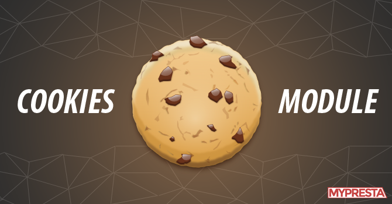

# Cookie Module
<div style="text-align:center"></div>
<br>

Es un analizador de cookies y parser HTTP básico para servidores HTTP.

## Instalación
```
$ npm install cookie
```

## API

```
var cookie = require('cookie');
```

 * cookie.parse(str, options)

 Analiza una cadena de encabezado de cookies HTTP y devuelve un objeto con todos los pares nombre-valor de cookie. El argumento str es la cadena que representa un valor de encabezado Cookie y las opciones son un objeto opcional que contiene opciones de análisis adicionales.
  ```
  var cookies = cookie.parse('foo=bar; equation=E%3Dmc%5E2');
  // { foo: 'bar', equation: 'E=mc^2' }
  ```

  **decode**

 Especifica una función que se utilizará para decodificar el valor de una cookie. Dado que el valor de una cookie tiene un conjunto de caracteres limitado (y debe ser una cadena simple), esta función se puede utilizar para decodificar un valor de cookie previamente codificado en una cadena JavaScript u otro objeto.

 La función predeterminada es el decodeURIComponente global, que decodificará cualquier secuencia codificada por URL en sus representaciones de bytes.

 **cookie.serialize(name, value, options)**

 Serializa un par nombre-valor de cookie en una cadena de encabezado Set-Cookie. El argumento de nombre es el nombre de la cookie, el argumento de valor es el valor para establecer la cookie y el argumento options es un objeto opcional que contiene opciones de serialización adicionales.
 ```
 var setCookie = cookie.serialize('foo', 'bar');
 // foo=bar
 ```

 **domain**

 Especifica el valor para el atributo Set-Cookie de dominio. De forma predeterminada, no se establece ningún dominio y la mayoría de los clientes considerarán que la cookie se aplicará únicamente al dominio actual

 **encode**
 Especifica una función que se utilizará para codificar el valor de una cookie. Dado que el valor de una cookie tiene un juego de caracteres limitado (y debe ser una cadena simple), esta función se puede utilizar para codificar un valor en una cadena adecuada para el valor de una cookie.

 La función predeterminada es ecodeURIComponent global, que codificará una cadena de JavaScript en secuencias de bytes UTF-8 y, a continuación, codificará la URL que caiga fuera del intervalo de cookies

 **expires**

 Especifica que el objeto Date sea el valor para el atributo Expires Set-Cookie. De forma predeterminada, no se establece ninguna caducidad y la mayoría de los clientes consideran esto una "cookie no persistente" y la eliminarán en una condición como salir de una aplicación de navegador web.

 **httpOnly**

 Especifica el valor booleano para el atributo [HttpOnly Set-Cookie].Cuando verdad, el atributo HttpOnly se establece, de lo contrario no lo es. De forma predeterminada, el atributo HttpOnly no está establecido.

 **MaxAge**

 Especifica el número (en segundos) como el valor del atributo Max-Age Set-Cookie. El número dado se convertirá en un número entero redondeando hacia abajo. De forma predeterminada, no se establece una edad máxima.


 **Path**

 Especifica el valor del atributo Path Set-Cookie. De forma predeterminada, la ruta de acceso se considera la ruta predeterminada. Por defecto, no se establece una edad máxima, y ​​la mayoría de los clientes consideran esto una "cookie no persistente" y la eliminarán en una condición como salir de una aplicación de navegador web.

 **SameSite**

 Especifica el valor booleano o la cadena como el valor del atributo Set-Cookie de SameSite.

 * True establecerá el atributo SameSite en Strict para  la estricta aplicación del mismo sitio.

* False no establecerá el atributo SameSite.

* 'Lax' establecerá el atributo de SameSite a Lax para la aplicación del mismo sitio laxa.

* 'Strict' establecerá el atributo SameSite en Strict  para la estricta aplicación del mismo sitio.
Puede encontrar más información sobre los diferentes niveles de aplicación en la especificación  

 ## Ejemplo

El siguiente ejemplo utiliza este módulo junto con el servidor HTTP principal de Node.js para solicitar a un usuario su nombre y mostrarlo de nuevo en futuras visitas.
 ```
var cookie = require('cookie');
var escapeHtml = require('escape-html');
var http = require('http');
var url = require('url');

function onRequest(req, res) {
  // Parse the query string
  var query = url.parse(req.url, true, true).query;

  if (query && query.name) {
    // Set a new cookie with the name
    res.setHeader('Set-Cookie', cookie.serialize('name', String(query.name), {
      httpOnly: true,
      maxAge: 60 * 60 * 24 * 7 // 1 week
    }));

    // Redirect back after setting cookie
    res.statusCode = 302;
    res.setHeader('Location', req.headers.referer || '/');
    res.end();
    return;
  }

  // Parse the cookies on the request
  var cookies = cookie.parse(req.headers.cookie || '');

  // Get the visitor name set in the cookie
  var name = cookies.name;

  res.setHeader('Content-Type', 'text/html; charset=UTF-8');

  if (name) {
    res.write('<p>Welcome back, <b>' + escapeHtml(name) + '</b>!</p>');
  } else {
    res.write('<p>Hello, new visitor!</p>');
  }

  res.write('<form method="GET">');
  res.write('<input placeholder="enter your name" name="name"> <input type="submit" value="Set Name">');
  res.end('</form');
}

http.createServer(onRequest).listen(3000);
 ```

 ## Comprobación

  ```
  $ npm test
   ```
