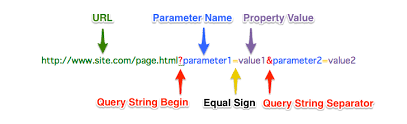

# Query string

<div style="text-align:center"></div>
<br>

En la World Wide Web, una cadena de consulta es la parte de un localizador de recursos uniforme (URL) que contiene datos que no encaja convenientemente en una estructura de ruta jerárquica. La cadena de consulta incluye normalmente campos añadidos a una URL base por un explorador Web u otra aplicación cliente, por ejemplo como parte de un formulario HTML.

Un servidor web puede manejar una solicitud de protocolo de transferencia de hipertexto, ya sea leyendo un archivo de su sistema de archivos basado en la ruta de acceso de URL o manejando la solicitud utilizando la lógica que es específica para el tipo de recurso. En los casos en que se invoca una lógica especial, la cadena de consulta estará disponible para esa lógica para su procesamiento, junto con el componente de ruta de la URL.

 * Una URL típica que contiene una cadena de consulta es la siguiente:

   ```
   http://example.com/over/there?name=ferret
   ```

Cuando un servidor recibe una solicitud para tal página, puede ejecutar un programa, pasando la cadena de consulta, que en este caso es, nombre = hurón sin cambios, al programa. El primer signo de interrogación se utiliza como un separador, y no es parte de la cadena de consulta.

Un enlace en una página web puede tener una dirección URL que contiene una cadena de consulta. HTML define tres formas en que un agente de usuario puede generar la cadena de consulta:
```
Un formulario HTML a través del elemento
<form> ... </ form>
Un mapa de imagen del lado del servidor a través del atributo ismap en el elemento  con una construcción 
Una búsqueda indexada a través del elemento ahora obsoleto <isindex>
```

## Formularios web  

Uno de los usos originales era contener el contenido de un formulario HTML, también conocido como formulario web. En particular, cuando se envía un formulario que contiene los campos campo1, campo2, campo3, el contenido de los campos se codifica como una cadena de consulta como sigue:
```
field1=value1&field2=value2&field3=value3...
```

* La cadena de consulta se compone de una serie de pares de valores de campo.

* Dentro de cada par, el nombre del campo y el valor están separados por un signo igual, '='.

* La serie de pares está separada por el signo "&" (o punto y coma, ";" para las URL incrustadas en HTML y no generadas por un ```<form> ... </ form>.```

#Ejemplo

Si un formulario está incrustado en una página HTML de la siguiente manera:

```
<form action="cgi-bin/test.cgi" method="get">
  <input type="text" name="first" />
  <input type="text" name="second" />
  <input type="submit" />
</form>
```


Y el usuario inserta las cadenas "esto es un campo" y "¿estaba claro (ya)?" En los dos campos de texto y presiona el botón de envío, el programa test.cgi (el programa especificado por el atributo de acción del elemento de formulario En el ejemplo anterior) recibirá la siguiente cadena de consulta:
```
first=this+is+a+field&second=was+it+clear+%28already%29%3F.
```

## Tracking


Un programa que recibe una cadena de consulta puede ignorar una parte o la totalidad de ella. Si la URL solicitada corresponde a un archivo y no a un programa, se omite toda la cadena de consulta. Sin embargo, independientemente de si se utiliza o no la cadena de consulta, toda la URL, incluida la misma, se almacena en los archivos de registro del servidor.

Estos hechos permiten que las cadenas de consulta se utilicen para rastrear usuarios de una manera similar a la proporcionada por las cookies HTTP. Para que esto funcione, cada vez que el usuario descarga una página, debe elegirse un identificador único y agregarse como una cadena de consulta a las URL de todos los enlaces que contiene la página. Tan pronto como el usuario siga uno de estos enlaces, la URL correspondiente se solicita al servidor. De esta manera, la descarga de esta página está vinculada con la anterior.

Por ejemplo, cuando se solicita una página web que contenga lo siguiente:
```
<a href="foo.html">see my page!</a>
<a href="bar.html">mine is better</a>
```
Se elige una cadena única, como e0a72cb2a2c7, y la página se modifica de la siguiente manera:
```
<a href="foo.html?e0a72cb2a2c7">see my page!</a>
<a href="bar.html?e0a72cb2a2c7">mine is better</a>
```

La adición de la cadena de consulta no cambia la forma en que se muestra la página al usuario. Cuando el usuario sigue, por ejemplo, el primer enlace, el navegador solicita la página foo.html? E0a72cb2a2c7 al servidor, que ignora lo que sigue? Y envía la página foo.html como se esperaba, agregando la cadena de consulta a sus enlaces también.

De esta forma, cualquier petición de página posterior de este usuario llevará la misma cadena de consulta e0a72cb2a2c7, lo que permitirá establecer que todas estas páginas han sido vistas por el mismo usuario. Las cadenas de consulta se utilizan a menudo en asociación con web beacons.

Las principales diferencias entre las cadenas de consulta utilizadas para el seguimiento y las cookies HTTP son las siguientes:

* Las cadenas de consulta forman parte de la URL y, por lo tanto, se incluyen si el usuario guarda o envía la URL a otro usuario; Las cookies se pueden mantener en todas las sesiones de navegación, pero no se guardan ni se envían con la URL.

* Si el usuario llega al mismo servidor web por dos (o más) rutas independientes, se le asignarán dos cadenas de consulta diferentes, mientras que las cookies almacenadas serán iguales.

*  El usuario puede desactivar las cookies, en cuyo caso el uso de cookies para el seguimiento no funciona. Sin embargo, el uso de cadenas de consulta para el seguimiento debe funcionar en todas las situaciones.

* Diferentes cadenas de consulta pasadas por diferentes visitas a la página significan que las páginas nunca se sirven desde el caché del navegador (o proxy, si está presente) aumentando así la carga en el servidor web y ralentizando la experiencia del usuario.
